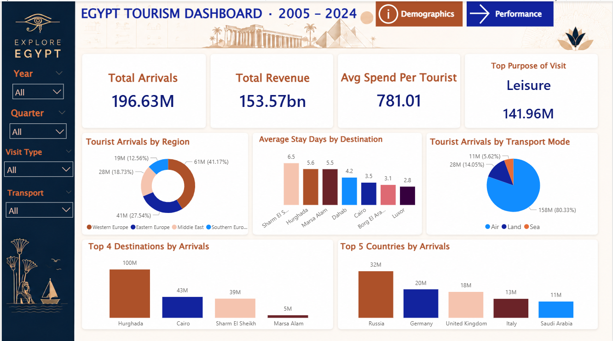
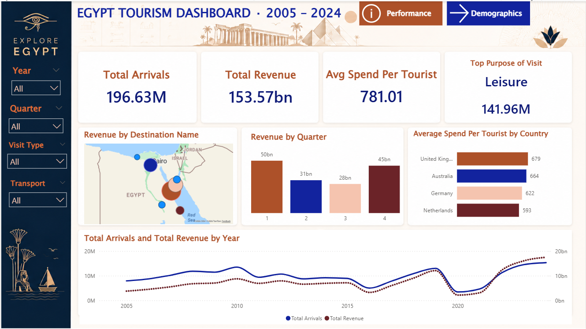

# 🇪🇬 Egypt Tourism Power BI Dashboard (2005–2024)

An interactive **Power BI dashboard** that analyzes Egypt's tourism performance from **2005 to 2024**. The project transforms raw tourism data into actionable business insights through data modeling, DAX calculations, and interactive visualizations.

---

## 📖 Project Overview

This dashboard provides a comprehensive analysis of Egypt's tourism sector over a 20-year period. By combining multiple dimension tables with a centralized fact table using a **Star Schema** model, it enables users to explore tourism trends, visitor behavior, revenue performance, and destination popularity through interactive reports.

The dashboard is designed to support data-driven decision-making for tourism stakeholders by presenting key metrics in a clear and intuitive format.

---

## 🎯 Objectives

- Analyze tourism arrivals and revenue trends from **2005–2024**.
- Measure and monitor the **average spending per tourist**.
- Identify the most common **purposes of visit**.
- Compare tourism performance across **countries and regions**.
- Discover the most visited destinations in Egypt.
- Analyze quarterly revenue distribution.
- Build an interactive dashboard for dynamic data exploration.

---

## 🛠️ Technologies Used

| Technology | Purpose |
|------------|---------|
| 📊 Power BI | Interactive Dashboard & Visualization |
| 🔄 Power Query | Data Cleaning & Transformation |
| 🧮 DAX | Measures, KPIs & Calculated Columns |
| ⭐ Star Schema | Data Modeling |

---

## 🗂️ Data Model

The dashboard is built using a **Star Schema** to improve performance and simplify analysis.

| Table | Description |
|-------|-------------|
| **Main_Data** | Fact table containing tourist arrivals, revenue, and related metrics |
| **Dim_Date** | Date dimension |
| **Dim_Country** | Country dimension |
| **Dim_Destination** | Tourist destination dimension |

---

# 📊 Dashboard Pages

## 1️⃣ Demographics Dashboard

This page focuses on understanding visitor demographics and travel behavior.

### Key Insights

- 🌍 Tourist arrivals by source region.
- ✈️ Arrivals by transportation mode (Air, Land, Sea).
- 🏛 Average stay duration by destination.
- 📍 Most visited destinations in Egypt.
- 🌐 Top source countries by tourist arrivals.

### Featured Destinations

- Hurghada
- Cairo
- Sharm El Sheikh
- Marsa Alam

### Top Source Countries

- Russia
- Germany
- United Kingdom
- Italy
- Saudi Arabia

### Dashboard Preview

---

## 2️⃣ Performance Dashboard

This page highlights Egypt's tourism performance through financial and operational metrics.

### Key Insights

- 📈 Total Arrivals vs. Total Revenue by Year.
- 💰 Revenue trends over time.
- 🗺 Revenue distribution across destinations.
- 📅 Quarterly revenue analysis.
- 💵 Average spend per tourist by country.

### Dashboard Preview

---

# 📌 KPIs Included

- Total Tourist Arrivals
- Total Tourism Revenue
- Average Spend per Tourist
- Average Stay Duration
- Top Tourist Destination
- Top Source Country
- Revenue by Quarter

---

## ✨ Key Features

- Interactive slicers and filters
- Dynamic KPI cards
- Time-series analysis
- Geographic visualization
- Regional comparison
- Destination performance analysis
- Drill-down capabilities

---

## 💡 Business Value

This dashboard enables decision-makers to:

- Monitor tourism growth over time.
- Identify high-performing destinations.
- Understand visitor demographics.
- Compare regional tourism performance.
- Track revenue generation.
- Support tourism planning using data-driven insights.

---

## 📷 Dashboard Gallery

### Demographics

### Performance

---

## 🚀 Future Enhancements

- Forecast tourism arrivals and revenue.
- Add hotel occupancy analysis.
- Integrate real-time tourism datasets.
- Enhance geographical analysis with interactive maps.

---

## ⭐ If you found this project useful, consider giving the repository a Star!
